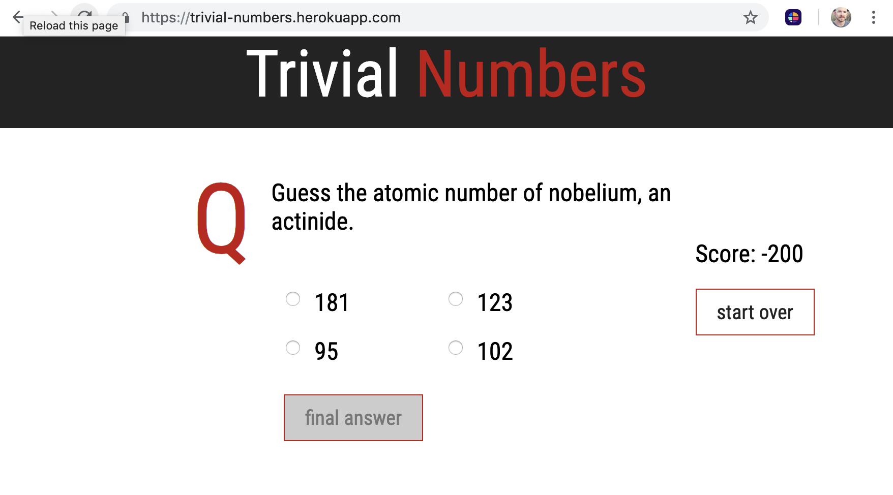

 

# [Trivial Numbers](https://trivial-numbers.herokuapp.com/)

This is a simple game made in Rails that uses facts provided by [NubersAPI](http://numbersapi.com/#42) to create a multiple choice quiz.

At this point, the semantics of the questions are strange because it relies on the wording of the fact received from the API, which doesn't follow a strict convention.

The way the answers are generated also makes it easy to cheat. Can you find the flaw?

The app stores game uuid's in session storage, and retrieves game instances from Redis cache store using those ids.

## To Play with the Code

- Clone down the repo with `git clone ...`
- Create a database with `rake db:create`
- start the server with `rails s`
- check it out on `localhost:3000`

Tech Stack
- Rails 5.2
- Ruby 2.4.1
- Redis
- scss
